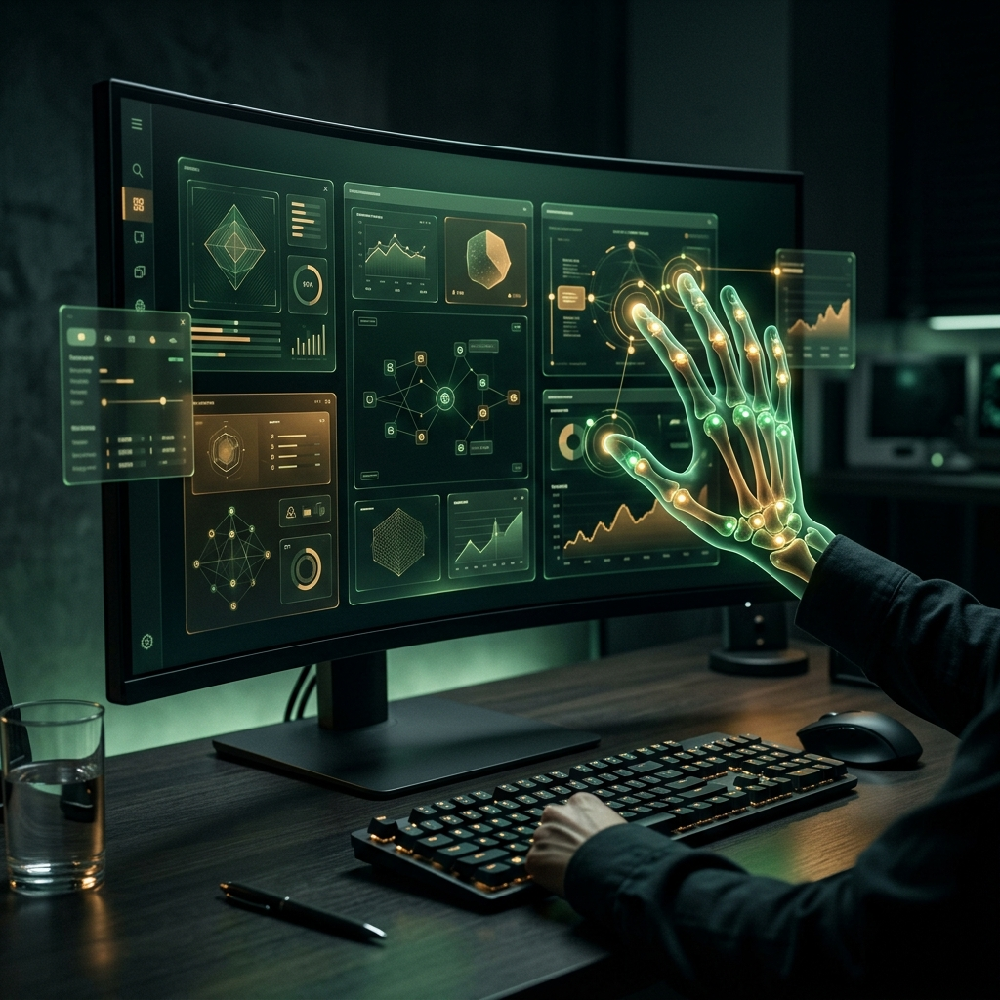
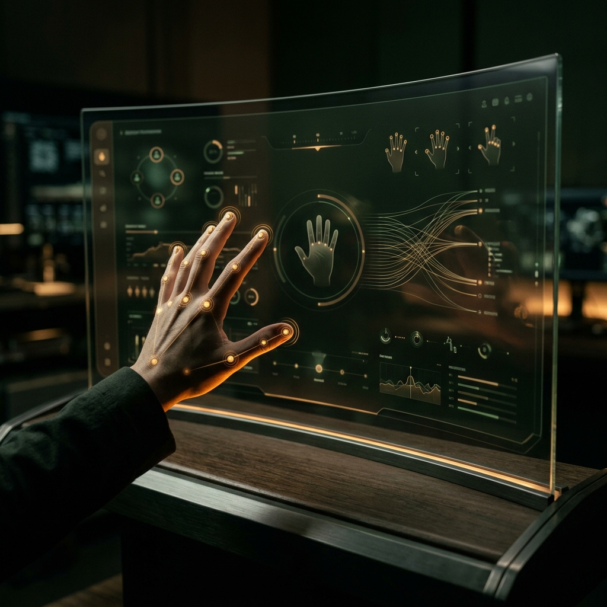
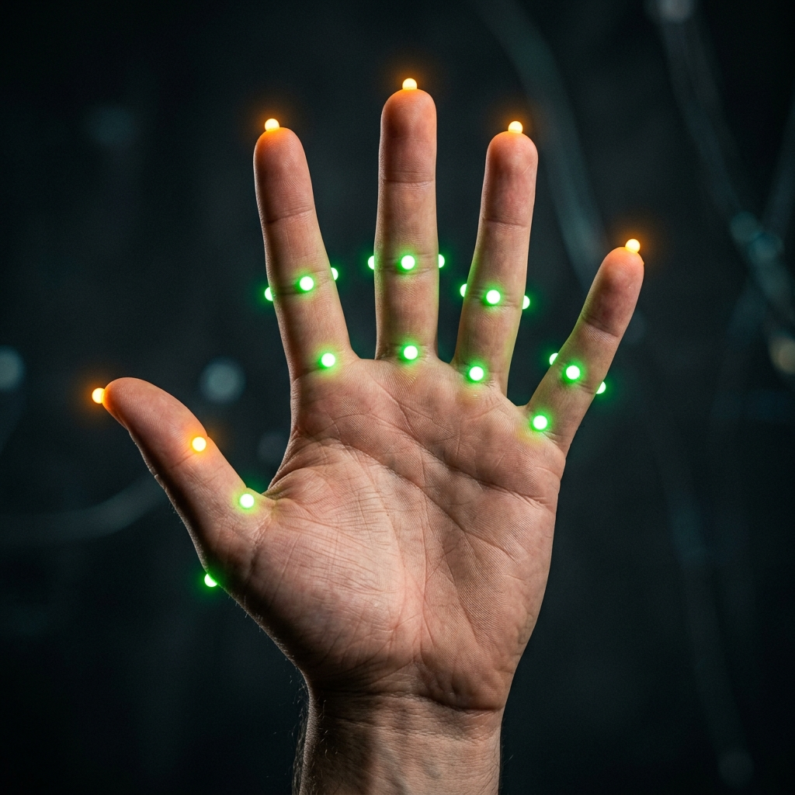

# RunAnywhere AI Gestra

RunAnywhere AI Gestra is an offline-first desktop interaction system that combines hand-gesture control, voice-triggered assistance, and system automation in a single Electron application. It is designed to feel natural on a laptop or workstation: raise a hand, trigger a gesture, speak a command, and control the desktop without breaking focus.

This project is documented as a RunAnywhere AI experience. The intended AI stack is centered on RunAnywhere's on-device runtime, local model loading, and desktop-side execution rather than third-party hosted assistants.

## Overview

RunAnywhere AI Gestra brings together three core layers:

- Real-time gesture recognition for desktop control
- Voice-driven assistant workflows inside the app shell
- Offline-first local execution for system actions and runtime feedback

The result is a desktop tool that can monitor hand landmarks, translate stable gestures into actions, and provide a more immersive, touch-free control flow for browsing, productivity, demos, and accessibility-oriented interaction.

## Key Highlights

- Offline-first desktop experience for gesture control and runtime interaction
- RunAnywhere AI focused positioning and model workflow
- Real-time camera-based hand tracking
- Native desktop actions such as cursor movement, scroll, click, screenshot, and media control
- Embedded assistant panel with voice-ready interaction states
- Electron-based desktop shell with Python-assisted vision runtime support
- Polished visual interface with live feedback and onboarding cues

## Screenshots

### Main Workspace



### Gesture UI Preview



### Palm Gesture Detection



## RunAnywhere AI Positioning

This project is intended to be presented as a RunAnywhere AI application. The README, product framing, and feature explanation are centered on RunAnywhere's local AI workflow:

- On-device runtime behavior
- Local model loading
- Desktop-native interaction
- Offline-first control flows
- Voice, language, and vision experiences tied to a local runtime model stack

## Model Stack

The RunAnywhere AI flow in this project is organized around the following model categories:

- `LLM` for assistant responses and text reasoning
- `VLM` for vision-capable flows in RunAnywhere-enabled experiences
- `VAD` for voice activity detection
- `STT` for speech-to-text
- `TTS` for text-to-speech

The codebase and test artifacts reference a RunAnywhere-compatible LLM load flow using:

- `lfm2-350m-q4_k_m`

In the broader RunAnywhere workflow, the application is structured to support a local, on-device model pipeline instead of a cloud-first dependency chain.

## Offline-First Experience

RunAnywhere AI Gestra is built and documented as an offline-first desktop app.

- Gesture recognition runs locally on the device
- Desktop actions are executed locally
- Voice interaction states are managed inside the desktop shell
- The user experience is designed around local runtime behavior, not a browser-only SaaS workflow

This makes the project a strong fit for private demos, local experimentation, accessibility workflows, and environments where low-latency interaction matters.

## Features

### Gesture Control

Gestra detects a stable hand pose and maps it to a desktop action.

| Gesture | Action |
| --- | --- |
| Open palm | Scroll up continuously while held |
| Closed fist | Scroll down continuously while held |
| Peace | Capture screenshot |
| Thumbs up | Play or pause media |
| Index point | Move cursor |
| Pinch | Left click |

### Assistant Experience

- Embedded assistant panel inside the desktop UI
- Voice orb and runtime state feedback
- Command-style interaction flow
- Local desktop command handling for common actions

### Desktop Automation

- Cursor movement
- Click and scroll actions
- Screenshot trigger
- Media playback control
- Window and app-level interaction support

## How It Works

The application supports a desktop-oriented runtime architecture:

### 1. Electron Shell

The Electron layer manages the window, preload bridge, desktop integrations, assistant IPC, and runtime orchestration.

### 2. Vision Layer

Hand landmarks are processed through MediaPipe-based gesture recognition. Depending on the mode, the app can use a browser-side camera flow or a Python-powered vision bridge.

### 3. Action Layer

Recognized gestures are stabilized, translated into action intents, and then executed as desktop operations.

### 4. Assistant Layer

The assistant UI handles typed and voice-assisted interaction while maintaining status feedback and conversational state.

## Runtime Modes

### Collective Vision Mode

In collective mode, the Python runtime owns the camera feed and exposes synchronized state for the Electron UI. This mode is useful when the app needs a dedicated vision pipeline and desktop action bridge.

### Local Camera Mode

In local camera mode, the Electron app uses `getUserMedia` and local gesture processing in the renderer. When available, it can still forward gesture events through the desktop bridge.

## Project Structure

| Path | Responsibility |
| --- | --- |
| `electron/main.cjs` | Electron main process, assistant bridge, desktop runtime orchestration |
| `electron/preload.cjs` | Secure renderer bridge for desktop APIs |
| `src/main.js` | Main application startup flow and UI coordination |
| `src/assistant.js` | Assistant panel, voice state, and interaction logic |
| `src/gesture-mediapipe.js` | Browser-side hand landmark detection |
| `src/actions.js` | Gesture-to-action routing |
| `src/ui.js` | Runtime UI updates and gesture feedback |
| `src/tts.js` | Speech synthesis helpers |
| `python-core/main.py` | Python runtime, bridge endpoints, and vision coordination |
| `python-core/gesture.py` | Gesture classification and hand landmark pipeline |
| `python-core/actions.py` | Desktop action execution and motion smoothing |

## Getting Started

### Prerequisites

- Node.js
- npm
- Python 3.x
- Windows desktop environment for native action behavior

### Install

```bash
npm install
```

### Start Development

```bash
npm run dev
```

### Build Production Bundle

```bash
npm run build
```

### Create Desktop Distribution

```bash
npm run dist
```

## Scripts

| Command | Description |
| --- | --- |
| `npm run dev` | Start the Vite development environment |
| `npm run build` | Build the production frontend bundle |
| `npm run preview` | Preview the built frontend |
| `npm run dist` | Build and package the Electron app |

## Use Cases

- Touch-free desktop navigation
- Presentation control
- Accessibility-inspired interaction
- Gesture-based demos and experiments
- Local AI desktop showcase projects
- Human-computer interaction prototypes

## Why This Project Stands Out

RunAnywhere AI Gestra is more than a gesture demo. It blends interface design, desktop automation, local runtime orchestration, and AI-ready interaction patterns into a single product direction. The combination of gesture feedback, voice signaling, and on-device workflow design makes it suitable for modern desktop AI experiences that need to feel responsive and tangible.

## Future Direction

Planned or natural next-step improvements include:

- Deeper RunAnywhere model integration across assistant flows
- Expanded offline voice pipeline coverage
- More configurable gesture packs
- Better model selection and local runtime controls
- Stronger packaging for production-ready desktop release flows

## License

This project is currently provided without an explicit production license declaration in the application setup. Add a final license before public distribution if needed.
