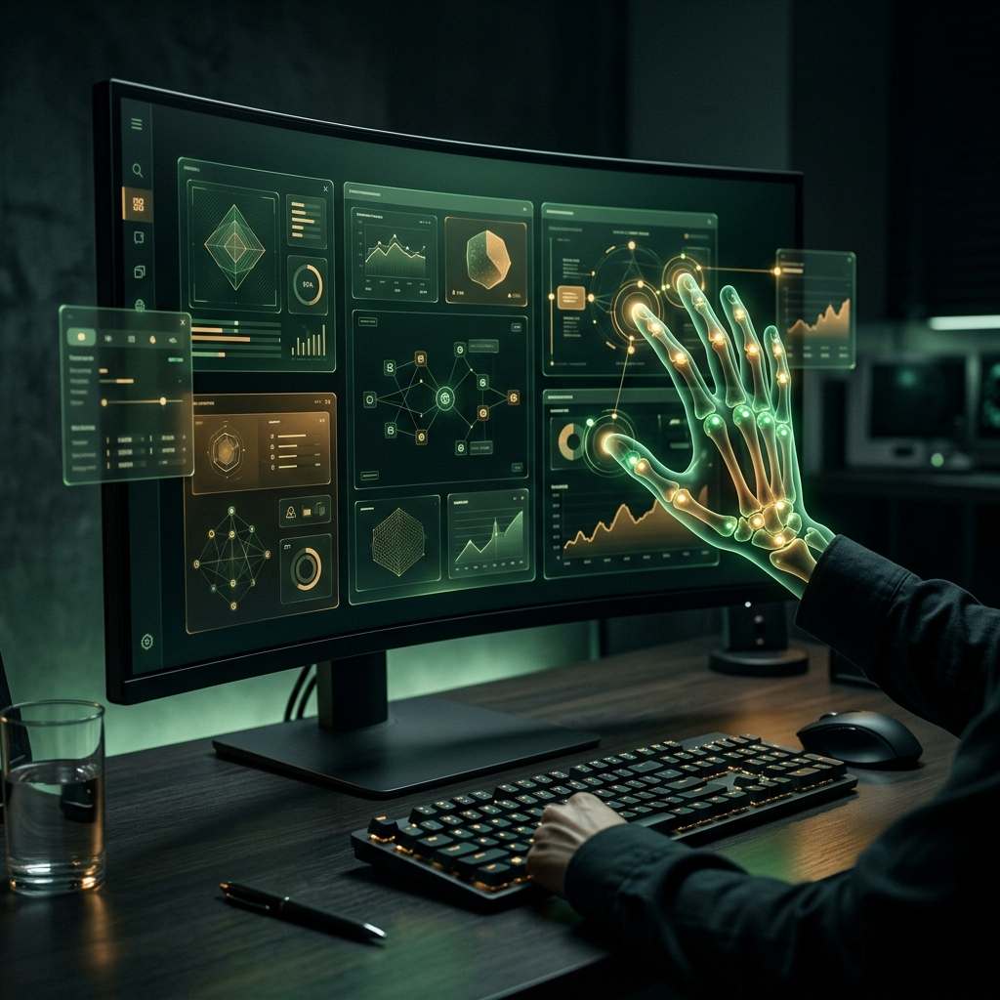
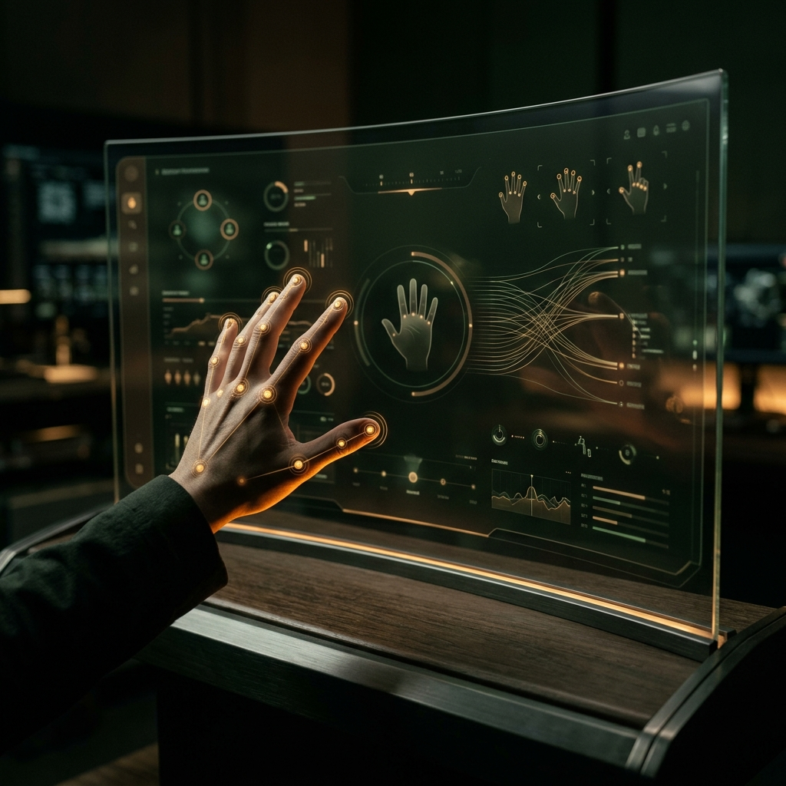
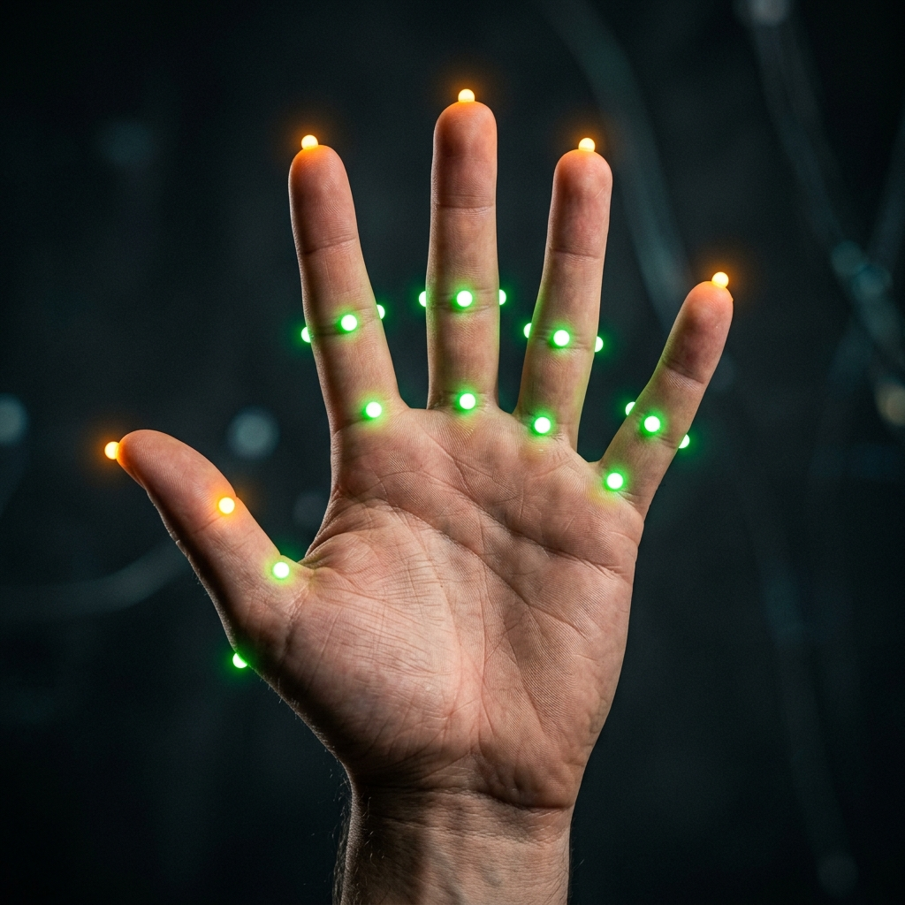

# Gestra — AI Gesture & Voice Interaction Platform

Gestra is an AI-powered gesture and voice interaction platform that enables hands-free control, real-time hand tracking, and conversational assistance directly in the browser. It combines computer vision, speech technologies, and AI-driven interaction workflows to create a natural and intuitive human-computer interaction experience.

Built with modern web technologies, Gestra leverages real-time hand landmark detection, gesture recognition, voice interaction, and AI-assisted responses to deliver a seamless, cross-platform experience without requiring native desktop runtimes.

## Overview

Gestra brings together four core layers:

* Real-time gesture recognition
* Voice-driven AI interaction
* Intelligent assistant workflows
* Browser-based execution with local-first capabilities

The result is a platform capable of monitoring hand landmarks, translating gestures into meaningful actions, processing voice commands, and providing an interactive AI experience for productivity, accessibility, education, and experimentation.

## Key Highlights

* Real-time camera-based hand tracking
* Browser-based gesture recognition
* Voice-enabled AI assistant
* MediaPipe-powered hand landmark detection
* Responsive and modern user interface
* Cross-platform deployment support
* Local-first AI workflow design
* Interactive visual feedback and onboarding experience

## Screenshots

### Main Workspace



### Gesture UI Preview



### Palm Gesture Detection



## AI-First Architecture

Gestra is designed around an AI-centric interaction model where computer vision, speech technologies, and intelligent workflows work together to create a natural user experience.

Core principles include:

* Real-time interaction
* Human-centered design
* Gesture-based communication
* Voice-assisted workflows
* Local-first execution
* Privacy-conscious architecture

## Model Stack

The platform supports multiple AI workflow categories:

* **LLM** — Conversational AI and reasoning
* **VLM** — Vision-language understanding workflows
* **VAD** — Voice Activity Detection
* **STT** — Speech-to-Text
* **TTS** — Text-to-Speech

This architecture enables future integration with local and cloud-based AI models depending on deployment requirements.

## Features

### Gesture Recognition

Gestra detects hand landmarks and recognizes meaningful gestures in real time.

| Gesture       | Action            |
| ------------- | ----------------- |
| Open Palm     | Recognition Event |
| Closed Fist   | Recognition Event |
| Peace Sign    | Recognition Event |
| Thumbs Up     | Recognition Event |
| Pinch Gesture | Recognition Event |
| Index Point   | Recognition Event |

### AI Assistant

* Interactive chat interface
* Voice-based communication
* AI-generated responses
* Real-time interaction feedback
* Conversational workflows

### Voice Interaction

* Speech-to-Text conversion
* Text-to-Speech responses
* Voice command processing
* Voice activity detection
* Natural communication flow

### Smart Interaction Layer

* Gesture event processing
* Real-time visual feedback
* AI-assisted command execution
* Dynamic workflow management

## How It Works

The application follows a layered architecture:

### 1. Frontend Layer

The frontend is responsible for:

* User interface rendering
* Camera feed visualization
* Gesture feedback
* Assistant interaction panel
* Real-time status updates

### 2. Vision Layer

The vision system uses MediaPipe-powered hand landmark detection to:

* Track hand movements
* Detect landmarks
* Classify gestures
* Generate interaction events

### 3. AI Layer

The AI system handles:

* Conversational responses
* User interaction management
* Workflow orchestration
* Context-aware processing

### 4. Voice Layer

The voice subsystem manages:

* Speech recognition
* Voice activity detection
* Speech synthesis
* Voice command execution

### 5. Interaction Layer

This layer coordinates:

* Gesture inputs
* Voice commands
* Assistant responses
* User feedback mechanisms

## Technology Stack

### Frontend

* React
* Vite
* JavaScript
* HTML5
* CSS3

### AI & Computer Vision

* MediaPipe Tasks Vision
* Hand Landmark Detection
* Gesture Recognition

### Voice Technologies

* Web Speech API
* Speech Synthesis API
* Voice Activity Detection

### Development Tools

* Git
* GitHub
* VS Code

### Deployment

* Vercel
* Netlify

## Project Structure

| Path              | Responsibility             |
| ----------------- | -------------------------- |
| `src/App.jsx`     | Main application component |
| `src/components/` | Reusable UI components     |
| `src/pages/`      | Application pages          |
| `src/hooks/`      | Custom React hooks         |
| `src/services/`   | AI and voice services      |
| `src/gesture/`    | Gesture detection logic    |
| `src/utils/`      | Utility functions          |
| `src/assets/`     | Static assets and images   |
| `public/`         | Public resources           |

## Getting Started

### Prerequisites

* Node.js 18+
* npm

### Install Dependencies

```bash
npm install
```

### Start Development Server

```bash
npm run dev
```

### Build Production Version

```bash
npm run build
```

### Preview Production Build

```bash
npm run preview
```

## Scripts

| Command           | Description                  |
| ----------------- | ---------------------------- |
| `npm run dev`     | Start development server     |
| `npm run build`   | Build production application |
| `npm run preview` | Preview production build     |
| `npm run lint`    | Run linting checks           |

## Use Cases

* AI-powered gesture interaction
* Browser-based computer vision projects
* Accessibility-focused applications
* Human-computer interaction research
* Educational demonstrations
* Smart productivity workflows
* Voice-assisted experiences
* AI showcase projects
* Interactive technology demonstrations

## Why This Project Stands Out

Gestra combines computer vision, speech technologies, and AI-powered interaction into a single platform. Instead of focusing solely on gesture recognition, it creates a complete interaction ecosystem where users can communicate through gestures, voice, and conversational interfaces.

The combination of real-time hand tracking, AI-assisted workflows, and modern web technologies makes it a practical demonstration of next-generation human-computer interaction systems.

## Future Roadmap

Planned improvements include:

* Advanced gesture libraries
* Multi-hand recognition
* Personalized gesture profiles
* Expanded AI assistant capabilities
* Improved voice interaction workflows
* Offline AI model integration
* Enhanced accessibility features
* Mobile and tablet optimization
* Multi-language support

## License

This project is currently provided without an explicit production license declaration. Add an appropriate open-source or commercial license before public distribution.
